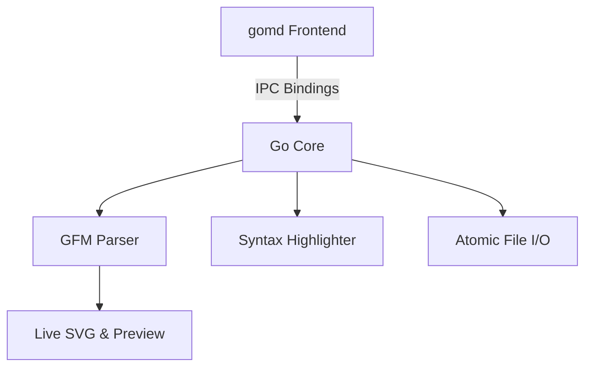

# gomd

> A lightning-fast, ultra-low memory minimalist Markdown editor built with **Go** and **Wails v2**.

---

## Highlights

- **⚡ Ultra-Low Memory Footprint**: Uses ~25MB - 35MB RAM compared to 300MB - 600MB+ for Electron-based editors.
- **📊 Interactive Mermaid Diagrams**: Live rendering of flowcharts, sequence diagrams, state machines, ER diagrams, class diagrams, mindmaps, git graphs, and Gantt charts with theme-adaptive SVG rendering.
- **🌐 Headless CLI Browser Preview**: View-only mode served on a custom port (`gomd --serve <file.md> --port 8080`) directly in your browser without launching the desktop GUI.
- **🗂️ Multi-File & Multi-Tab Support**: Open, edit, and switch between multiple documents seamlessly with dirty state tracking per tab.
- **🎨 Full Code Syntax Highlighting**: Powered by Chroma in Go backend with 100+ languages (Go, Python, JS, TypeScript, Rust, C++, HTML, JSON, Bash, SQL, YAML, etc.) adapting to dark/light/nord/solarized themes.
- **🚀 Native Go Markdown Processing**: Powered by `goldmark` with GitHub Flavored Markdown (tables, task lists, strikethrough, autolinks, footnotes, typographer).
- **🎯 Distraction-Free Modes**:
  - **Split View** (`Ctrl+\`): Side-by-side editing with synchronized live preview.
  - **Edit Only** (`Ctrl+E`): Clean focused editing interface.
  - **Preview Only** (`Ctrl+P`): Reader view for documents.
  - **Zen Mode** (`F11` / `Ctrl+Shift+F`): Fullscreen distraction-free writing environment.
- **💾 Robust File I/O**: Atomic writes, unsaved changes tracking, recent files history, and native multi-file dialogs.
- **🎨 Beautiful Modern Themes**: Dark, Light, OLED Black, Nord, and Solarized.
- **📤 Standalone HTML Export** (`Ctrl+Shift+H`): Export beautifully styled, self-contained HTML documents (with print styling for PDF).
- **🖥️ CLI Integration**: Launch desktop editor with `gomd notes.md` or headless browser preview with `gomd --serve notes.md -p 8080`.

---

## Mermaid Diagram Example

Write standard Mermaid blocks in your markdown and they render into interactive vector diagrams in real time:

````markdown

````

---

## CLI Usage (Browser Preview & Desktop Modes)

### 1. Headless Browser Preview Mode (View-Only in Web Browser)
Open any markdown file in a live-reloading browser preview without launching the desktop app:

```bash
# Preview on default port (8080) and auto-open browser
gomd --serve README.md --open

# Preview on a specific custom port (e.g. 3000)
gomd --serve document.md --port 3000
# or short flags:
gomd -s document.md -p 3000 -o
```

**Features in Browser Preview:**
- **Live Sync**: Uses Server-Sent Events (SSE) to automatically update the browser preview when the file is modified on disk (e.g. edited in Vim/VSCode/etc.).
- **Interactive Theme Switcher**: Dark, Light, OLED, Nord, and Solarized.
- **Mermaid & Chroma Highlighting**: Embedded vector diagram and code syntax rendering.
- **Print / Save as PDF**: Print-optimized stylesheet included.
- **Ultra-lightweight**: Consumes under ~5MB of RAM.

---

### 2. Desktop GUI Editor Mode
```bash
# Launch editor
gomd

# Open a specific file
gomd notes.md

# Open multiple files into tabs
gomd chapter1.md chapter2.md chapter3.md
```

---

## Desktop Keyboard Shortcuts

| Shortcut | Action |
| :--- | :--- |
| `Ctrl+T` / `Ctrl+N` | New Tab / Document |
| `Ctrl+W` | Close Active Tab |
| `Ctrl+Tab` / `Ctrl+Shift+Tab` | Next / Previous Tab |
| `Alt+1` .. `Alt+9` | Switch to Tab 1–9 |
| `Ctrl+O` / `Cmd+O` | Open File(s) |
| `Ctrl+S` / `Cmd+S` | Save Active File |
| `Ctrl+Shift+S` | Save As |
| `Ctrl+Shift+H` | Export to Standalone HTML |
| `Ctrl+E` | Editor Only Mode |
| `Ctrl+\` | Split View Mode |
| `Ctrl+P` | Preview Only Mode |
| `F11` / `Ctrl+Shift+F` | Zen / Fullscreen Mode |
| `Ctrl+F` | Find & Replace |
| `Ctrl+B` | Bold (`**text**`) |
| `Ctrl+I` | Italic (`*text*`) |
| `Ctrl+K` | Insert Link (`[title](url)`) |
| `Ctrl+Shift+C` | Fenced Code Block |
| `Ctrl+Shift+X` | Strikethrough (`~~text~~`) |
| `Tab` / `Shift+Tab` | Indent / Dedent selection |
| `Ctrl+/` | Keyboard Shortcuts Cheatsheet |

---

## Building and Running

### Prerequisites
- Go 1.20+
- Node.js 18+ & npm
- GTK3 and WebKitGTK (`webkit2gtk-4.1` on Linux)
- Wails v2 (`go install github.com/wailsapp/wails/v2/cmd/wails@latest`)

### Build Production Binary
```bash
wails build -tags webkit2_41
```
The compiled standalone binary will be generated at `./build/bin/gomd`.

### Run Development Mode (with Hot Reload)
```bash
wails dev -tags webkit2_41
```

### Run Tests
```bash
go test ./... -v
```
